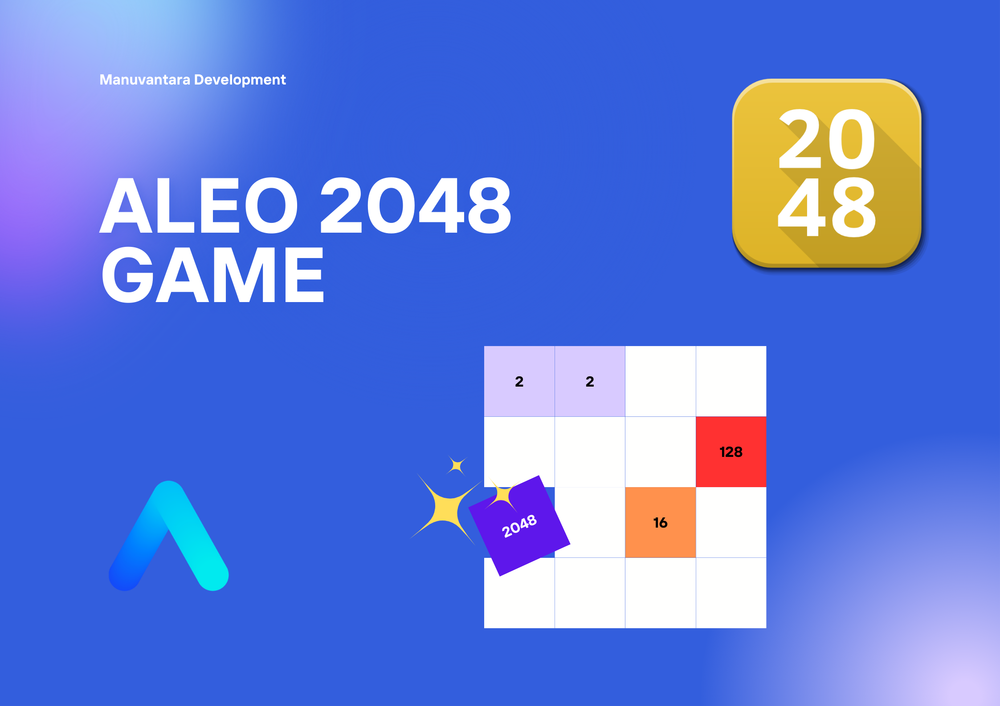

- [Summary](#summary)
  - [How to Build](#how-to-build)
  - [How to Run](#how-to-run)
    - [1. Initializing the Game](#1-initializing-the-game)
    - [2. Making Moves](#2-making-moves)
    - [2. Generating Tiles](#2-generating-tiles)
  - [Winning and Losing Conditions](#winning-and-losing-conditions)
  - [Move Validation](#move-validation)
  - [Game States](#game-states)
  - [Sequencing the States](#sequencing-the-states)
  - [Preventing Double Moves](#preventing-double-moves)
  - [Multiple Games](#multiple-games)

# Summary

2048 is a game for a one player, where the player is moving tiles towards some chosen side
within the gameboard, so it creates a gravity that merge equal tiles together forming the
sum of their values and generating a new tile. In order to win this game, a player should
form the number of 2048 on the board by merging equal squares.

## How to Build

To compile this Leo program, run:
```bash
leo build
```

## How to Run
<details open><summary>Commands and Playing the Game</summary>

### 1. Initializing the Game
In order to play 2048, there must a player who
creates an initial state with an empty board.
You can use the provided player accounts or [generate your own](https://aleohq.github.io/aleo/).
```markdown
Player:
  Private Key  APrivateKey1zkpGKaJY47BXb6knSqmT3JZnBUEGBDFAWz2nMVSsjwYpJmm
     View Key  AViewKey1fSyEPXxfPFVgjL6qcM9izWRGrhSHKXyN3c64BNsAjnA6
      Address  aleo1mgfq6g40l6zkhsm063n3uhr43qk5e0zsua5aszeq5080dsvlcvxsn0rrau

Board State 
  Owner  APrivateKey1zkpGKaJY47BXb6knSqmT3JZnBUEGBDFAWz2nMVSsjwYpJmm
  State Address  48368621571819494651133970645362186611
  Previous State Address  0
  Board  0
  Score  0
  Points  0
  Move  0
  Game State  0
```

Save the key and address. Set the `.env` private_key and address to the newly created aleo account.
Change the move_tiles input for a board_state for the board state data above.

Also, you can try do this through the terminal

```markdown
leo run init_game
```

### 2. Making Moves
When the board is created, even though it doesn't have any tiles, it should be moved so the state of
the board is changed to the 2 [(pending tile)](#game-states). This allows us to separate two logical
operations: tiles movement and tile generation. The board is moved using an existing board state, 
which cannot be pending tile, won, or lost. The board is moved towards selected side, where 0 is top,
1 is right, 2 is bottom and 3 is left going clockwise. You can either put data into input or run the
transition in a terminal:

```markdown
BOARDSTATE="{
  owner: aleo1mgfq6g40l6zkhsm063n3uhr43qk5e0zsua5aszeq5080dsvlcvxsn0rrau.private,
  state_address: 48368621571819494651133970645362186611u128.private,
  prev_state_address: 0u128.private,
  board: 0u64.private,
  score: 0u64.private,
  points: 0u64.private,
  move: 6u16.private,
  game_state: 0u8.private,
  _nonce: 3363569152212949816664016183510824598058606152546980218048198075207536860566group.public
}"

leo run move_tiles "${BOARDSTATE}" 1u8
```

And it will just change the game_state for 2 [(pending tile)](#game-states).

Let's see what happens if we have not an empty board. We can take this board as an example:
```markdown
2 0 2 0
0 0 0 0
0 4 0 0
0 0 8 0
```

And let's assume that we want to move it right, then the board state will look like this:

```markdown
0 0 0 4
0 0 0 0
0 0 0 4
0 0 0 8
```

The same applies for the move_tiles transition, except all the state is stored in a number
as a binary coded decimal.

### 2. Generating Tiles
After we made a move, it's stored on the blockchain, and we need to generate a new tile according
to the original 2048 game logic. This tile can be either 2 with the 90% chance of generation or a
4 with the 10% chance of generation. It uses pseudorandom function to generate a random position
for a tile, which depends on different factors such as user address, current state and movement,
which is random enough to sustain a normal gameplay. As built-in random function works only in a
finalize function, the pseudorandom function was created to overcome this restriction.

Input
```markdown
BOARDSTATE="{
  owner: aleo1mgfq6g40l6zkhsm063n3uhr43qk5e0zsua5aszeq5080dsvlcvxsn0rrau.private,
  state_address: 48368621571819494651133970645362186611u128.private,
  prev_state_address: 0u128.private,
  board: 0u64.private,
  score: 0u64.private,
  points: 0u64.private,
  move: 6u16.private,
  game_state: 0u8.private,
  _nonce: 3363569152212949816664016183510824598058606152546980218048198075207536860566group.public
}"

leo run generate_tile "${BOARDSTATE}"
```

Output
```markdown
BOARDSTATE="{
  owner: aleo1mgfq6g40l6zkhsm063n3uhr43qk5e0zsua5aszeq5080dsvlcvxsn0rrau.private,
  state_address: 61975646287020096341418534152802071699u128.private,
  prev_state_address: 84271489382108351405960455610417975257u128.private,
  board: 2305843009213693952u64.private,
  score: 0u64.private,
  points: 0u64.private,
  move: 0u16.private,
  game_state: 1u8.private,
  _nonce: 1591409095973463219716604668145452356563876860241847808106887132673116779137group.public
}"
```

The BCD board of the output above, where 0010 represents 2^2 = 4:
```markdown
0010 0000 0000 0000
0000 0000 0000 0000
0000 0000 0000 0000
0000 0000 0000 0000
```

## Winning and Losing Conditions

In order to win, the player should have at least 1 tile with the value of 2048 on the board.
When the player wins, the game state is changed 3 and the game state is not possible to
change anymore, as the game is finished.

In order to lose, the player should not have any free spaces on the board, and there should
not be any similar adjacent tiles that allow player to join them and continue the game.
When the player loses, the game state is changed 4 and the game state is not possible to
change anymore, as the game is finished.

## Move Validation

The move validation is fairly simple, as every movement logic is generated within the program,
and the only condition is that selected movement direction changes the state of the board.

Examples of valid moves:

```markdown
Board: 
0 0 2 0
0 0 0 0
0 0 0 0
0 0 0 0

Side: Right
```

```markdown
Board: 
0 0 0 2
0 0 0 0
0 4 0 0
0 0 0 8

Side: Top
```
Examples of invalid moves:

```markdown
Board: 
0 0 2 0
0 0 0 0
0 0 0 0
0 0 0 0

Side: Top
```

```markdown
Board: 
0 0 0 0
2 4 8 2
0 0 0 0
0 0 0 0

Side: Left
```

## Game States

There are 5 game states:

0 — Initial state, the game is just initialized.
1 — Movement state, the game waits for the player's movement choice.
2 — Pending tile state, the game waits for the player's generating tile request.
3 — Winning state, the game meets the winning condition and it has finished.
4 — Losing state, the game meets the losing condition and it has finished.

## Sequencing the States

As each state is connected to each other, the logic for the chaining the states was implemented,
so each state has own address and a reference to the previous state address, forming a chain which
allows to record all the game history of the records of a player.

The hash is a 128-bit unsigned integer generated using Poseidon8 hashing algorithm, so the board number, 
player address and the salt was hashed, and then there was a combined hash created out of these three hashes.

```markdown
Board -> Poseidon8
Player -> Poseidon8
Salt -> Poseidon8

State Hash -> Poseidon8 (Board, Player, Salt)
```

## Preventing Double Moves

The preventing of double moves depends on the fact that the most early move record connected to the
previous move record is valid, so the blockchain records all of the player movements and game history,
so it's possible to analyze the player movements and discard the invalid moves. 

## Multiple Games

The program supports the feature of playing multiple games at once, so players can start as many games they
can and the blockchain can recall them all.